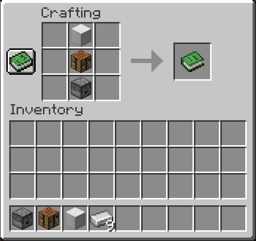
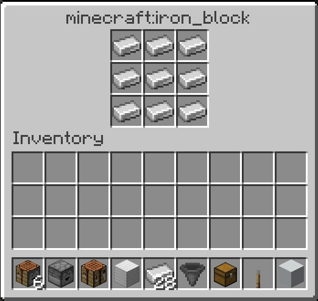
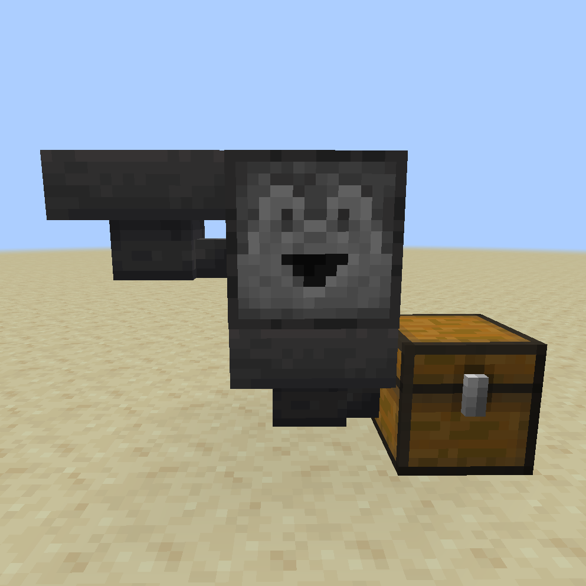
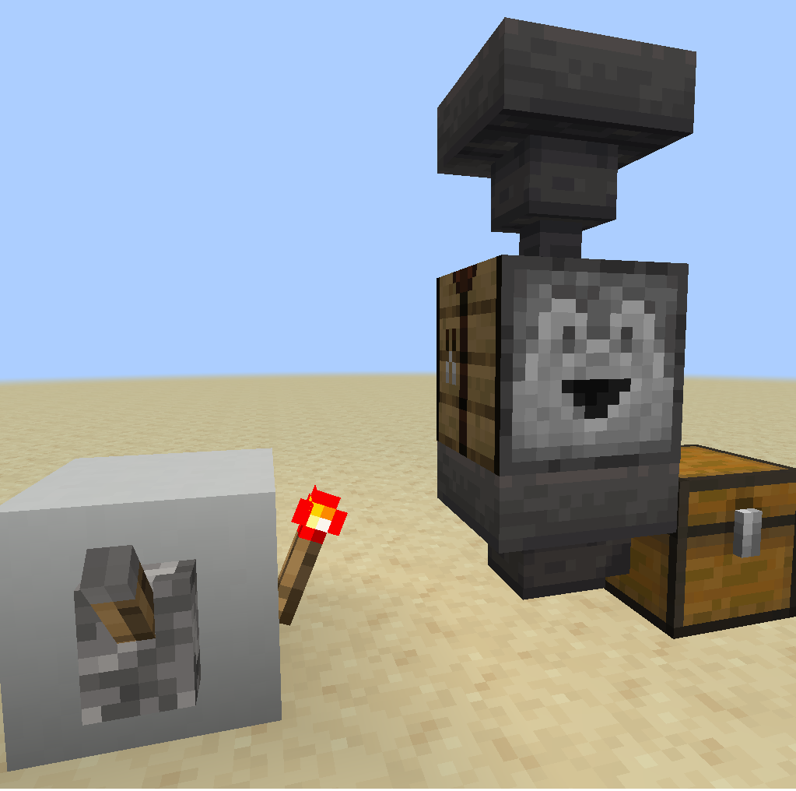
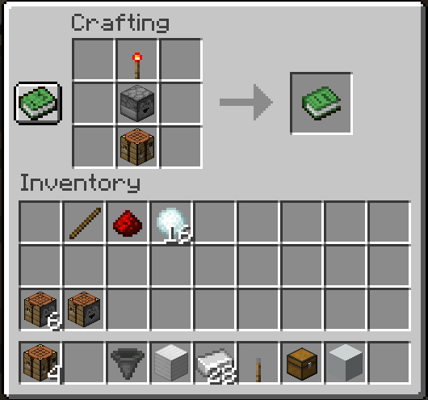
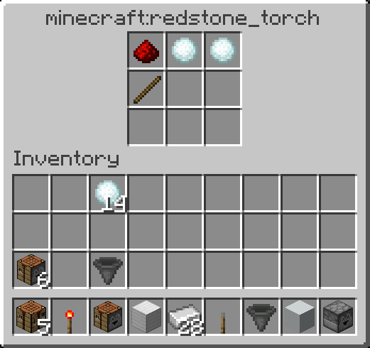

# Autocraft
Automate the crafting process with a redstone enabled crafting table.

## Installation

1. Visit the Releases page and download autocraft datapack zip file and resource pack.
2. Download the [v1.2.0 PlayerDB Datapack](https://github.com/rx-modules/PlayerDB/releases/tag/v1.2.0) `.zip` datapack.
3. Copy the downloaded datapack zip files into your world's datapacks folder at `%APPDATA%\.minecraft\saves\world\datapacks`
4. Copy the resource pack into the Minecraft Resource Pack area, and enable it.
4. Launch the world and type `/reload`
5. Check that the datapack is installed under the "Installed Datapacks" Advancement tab with `Ctrl + L`

## Usage

### Crafting an Autocrafter Block
There are two variations of Autocrafter, item specific and generic. The item specific Autocrafter only crafts for a specific result, rejecting any item configurations not defined by its set recipes. The generic Autocrafter can access any recipe in the game making it very flexible. At this stage in development one should prefer to use the item specifc crafters if they intend to create a large number of them, as the generic autocrafters may create lag when used at scale.

Generic Autocrafter Recipe

A generic Autocrafter is created by combining a `crafting_table` and `dropper`. Since it is a shapeless recipe any positioning of the ingredients with work. See the [Guide](#Guide) section for more details.

Item specific Autocrafter Recipe

Create an autocrafter for nearly any item in the game with the following recipe formula, 
`crafting_table + dropper + <item-of-choice> = autocrafter`. Since it is a shapeless recipe any positioning of the ingredients with work. See the [Guide](#Guide) section for more details.

  

### How it Works

The autocrafter will only work when there is a `hopper` below it. Lock the `hopper` and fill in the items for the recipe, then unlock the `hopper` to craft the item. Items filled into the autocrafter will **not** stack if there are spaces available. For example if three iron ingots are fed into the slot, they will spread to take up three slots as opposed to one.

While the hopper under the autocrafter is powered (locked) it will not attempt to craft any items. When unlocked (unpowered) the item will attempt to be crafted then pulled by the hopper.

Crafting items is straightforward for blocks such as an `iron_block` composed of nine ingots, but more complicated for shaped recipes like a `hopper`, requiring slots of air between some items. This can be accomplished my using placeholder items that get filtered out after.

## Guide

Single Ingredient Recipes 

Crafting recipes with a single ingredient do not require any additional redstone components to operate the autocrafter besided the hopper below. Items fed into the autocrafter will automatically be crafted and sent below immediately.
 

Multiple Ingredient Recipes 

Crafting recipes with multiple ingredients require locking the hopper for all ticks that the autocrafter is being loaded with the ingredients so that they do not fall through before the recipe is completed. Once loaded, the hopper can be unlocked and the item will be crafted.
 

Shaped Recipe Crafting 

Shaped recipes require placeholder items to be fed into slots that would be empty. These items must then be filtered out so that only the recipe ingredients remain. Depending on the recipe, this can require a fairly complex redstone setup.
 

---
## Caveats and Limitations
- Currently only single item stacks are supported in the autocraft. For example, it will not craft when there are 2+ ingredients in a stack

## TODO
- Item specific custom models to indicate autocrafter type
- Speed optimizations
- Support for item stacks
- Comparator interaction
- Interaction with hopper cooldown