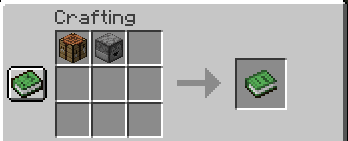
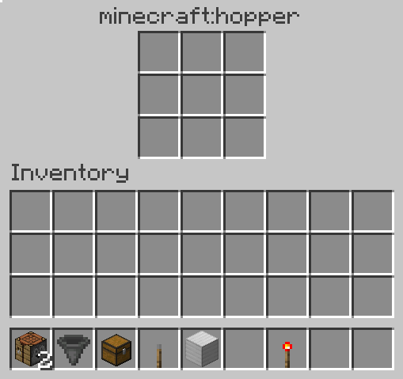
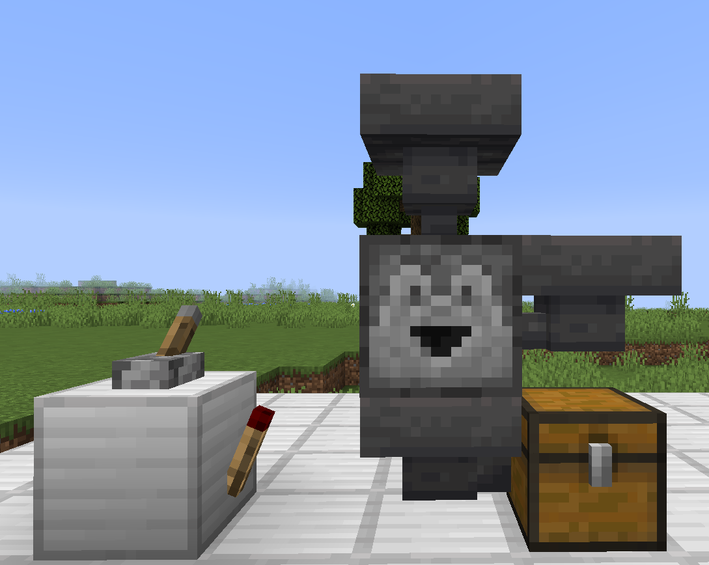

# Autocraft
Automate the crafting process with a redstone enabled crafting table.

## Installation

1. Visit the Releases page and download autocraft datapack zip file.
2. Download the latest [PlayerDB Datapack](https://github.com/rx-modules/PlayerDB/releases).
3. Copy the downloaded zip files into your world's datapacks folder at %APPDATA%\.minecraft\saves\world\datapacks
4. Launch the world and type /reload
5. Check that the datapack is installed under the "Installed Datapacks" Advancement tab with `Ctrl + L`

## Usage

You can create an autocrafter for nearly any item in the game with the following recipe formula, `crafting_table + dropper + <item-of-choice> = autocrafter`. Since it is a shapeless recipe any positioning of the ingredients with work.

The autocrafter will only work when there is a `hopper` below it. Lock the `hopper` and fill in the items for the recipe, then unlock the `hopper` to craft the item. Items filled into the autocrafter will not stack if there are spaces available. For example if three iron ingots are fed into the block, they will spread to take up three slots as opposed to one.

While the hopper under the autocrafter is powered (locked) it will not attempt to craft any items. When unlocked (unpowered) the item will attempt to be crafted then pulled by the hopper.

Crafting items is straightforward for blocks such as an `iron_block` composed of nine ingots, but more complicated for shaped recipes like a `hopper`, requiring slots of air between some items. This can be accomplished my using placeholder items that get filtered out after.

## Caveats and Limitations
- Currently only single item stacks are supported in the autocraft. For example, it will not craft when there are 2+ ingredients in a stack
- Non-item specific crafting is possible but not recommended as it is a very resource intensive operation to perform every tick and causes **significant** lag.
- Cannot move the table with pistons because it is a block entity.

## TODO
- Customization settings
- Item specific custom models to indicate autocrafter type
- Improve recipe matching logic
- Speed optimizations
- balance item stacks across slots